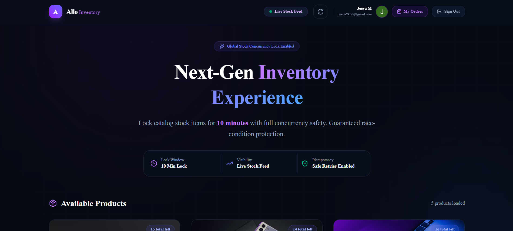
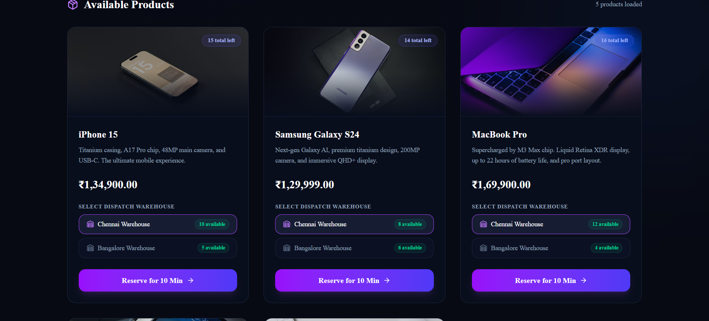
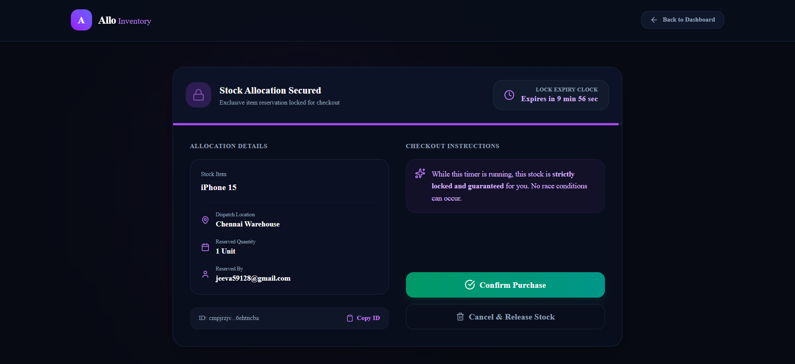
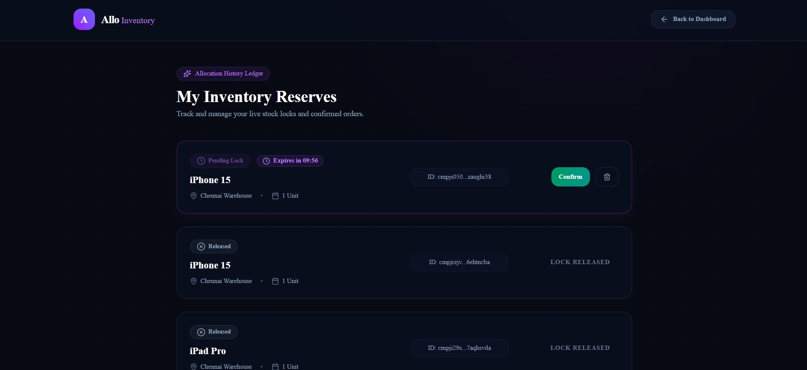

# 🚀 Allo Inventory – Reservation System

🔗 **Live Demo:**

👉 [https://allo-health-xi.vercel.app](https://allo-health-xi.vercel.app)

---

## 📌 Problem Overview

In high-demand inventory systems, a critical race condition occurs during checkout:

- If stock is reduced only after payment, multiple users may purchase the same unit.
- If stock is reduced at add-to-cart, inventory appears unavailable even when users abandon carts.

---

## ✅ Solution: Reservation System

We introduce a time-bound stock reservation system:

- When a user proceeds to checkout → stock is reserved for 10 minutes
- If payment succeeds → reservation is confirmed
- If payment fails / expires → reservation is released

This ensures:

✔ No overselling  
✔ Better user experience  
✔ Accurate inventory tracking

---

## 🧠 Key Features

- 🔒 Concurrency-safe reservations
- ⏳ 10-minute expiry system
- 🔁 Idempotent APIs (bonus)
- 🔐 Google OAuth authentication
- ⚡ Real-time stock updates
- 📦 Multi-warehouse inventory
- 📊 Reservation tracking (My Orders)

---

## 🖼️ UI Screens

### 🏠 Dashboard – Product Listing

<p align="center">
  
</p>
<p align="center">
  
</p>

**Explanation:**

- Displays all products with stock per warehouse
- User selects warehouse and reserves stock
- Shows real-time availability
- "Reserve for 10 Min" triggers reservation API

---

### 🧾 Reservation Page (Checkout)

<p align="center">
  
</p>

**Explanation:**

- Shows reservation details
- Countdown timer (expiry)
- Confirm → converts reservation to purchase
- Cancel → releases stock immediately

---

### 📦 My Orders / Reservation Ledger

<p align="center">
  
</p>

**Explanation:**

- Displays all reservations for logged-in user
- Shows:
  - Pending (with countdown)
  - Confirmed
  - Released
- Allows confirm/cancel actions

---

## ⚙️ Tech Stack

| Layer | Technology |
|---|---|
| Frontend | Next.js (App Router), TypeScript |
| Backend | Next.js API routes |
| Database | Supabase (PostgreSQL) |
| ORM | Prisma + @prisma/adapter-pg |
| Auth | NextAuth (Google OAuth) |
| Cache / Idempotency | Upstash Redis |
| Validation | Zod |
| Styling | Tailwind CSS + shadcn/ui |
| Deployment | Vercel |

---

## 🧩 System Architecture

### Core Entities

- **Product**
- **Warehouse**
- **Inventory**
  - total stock
  - reserved stock
- **Reservation**
  - status: `PENDING` | `CONFIRMED` | `RELEASED`
  - `expiresAt`

---

## ⚡ API Design

| Method | Endpoint | Description |
|---|---|---|
| GET | `/api/products` | List products with stock |
| GET | `/api/warehouses` | List warehouses |
| POST | `/api/reservations` | Create reservation (409 safe) |
| POST | `/api/reservations/:id/confirm` | Confirm reservation (410 if expired) |
| POST | `/api/reservations/:id/release` | Release reservation |

---

## 🔒 Concurrency Handling (CORE LOGIC)

**Problem:**

Two users trying to reserve last unit simultaneously

**✅ Solution:**

Atomic DB update:

```
available = total - reserved
```

Reservation succeeds **ONLY** if:

```
available >= requested_quantity
```

Otherwise:

```
409 Conflict
```

👉 Ensures race-condition-free system

---

## ⏳ Expiry Mechanism

Each reservation has:

```
expiresAt = now + 10 minutes
```

Cleanup handled via:

✔ API-based cleanup (`/api/cron/cleanup`)  
✔ Lazy cleanup on read  
✔ Manual release on cancel

If expired:

```
410 Gone
```

---

## 🔁 Idempotency (BONUS IMPLEMENTATION)

**Problem:**  
Client retries request (network issues) → duplicate reservations

**✅ Solution:**  
Using Redis (Upstash) with `Idempotency-Key`

**Flow:**

1. Client sends:
```
Idempotency-Key: unique-id
```

2. Server checks Redis:
   - If key exists → return stored response
   - If not → process request and store response

**Example:**

```javascript
const existing = await redis.get(key);

if (existing) return existing;

const result = await processReservation();

await redis.set(key, result);

return result;
```

Applied to:

✔ `/api/reservations`  
✔ `/api/reservations/:id/confirm`

**Result:**

✔ Safe retries  
✔ No duplicate side effects

---

## 🔐 Authentication

Implemented using NextAuth + Google OAuth

- Users must login to reserve
- Reservation linked to user email
- "My Orders" shows user-specific data

---

## 🗂️ Folder Structure

```
allo-health/
├── prisma/
│   ├── schema.prisma          # Database schema (Product, Warehouse, Inventory, Reservation)
│   ├── seed.ts                # Purges and seeds products & warehouse inventories
│   └── migrations/            # SQL migration history
├── src/
│   ├── app/
│   │   ├── layout.tsx         # Root layout wrapping client SessionProvider & Toaster
│   │   ├── page.tsx           # Premium interactive dashboard (Stock list, auth indicators)
│   │   ├── globals.css        # Tailwind/custom core variables and styles
│   │   ├── my-orders/
│   │   │   └── page.tsx       # Historical ledger listing active and confirmed reservations
│   │   ├── reservation/
│   │   │   └── [id]/
│   │   │       └── page.tsx   # Lock details screen featuring a high-fidelity countdown timer
│   │   └── api/
│   │       ├── auth/
│   │       │   └── [...nextauth]/
│   │       │       └── route.ts   # NextAuth route handler supporting Google OAuth
│   │       ├── cron/
│   │       │   └── cleanup/
│   │       │       └── route.ts   # GET endpoint triggering automatic expired lock releases
│   │       ├── my-reservations/
│   │       │   └── route.ts   # GET endpoint returning authenticated user's reservations
│   │       ├── products/
│   │       │   └── route.ts   # GET endpoint for real-time stock lists (force-dynamic)
│   │       ├── warehouses/
│   │       │   └── route.ts   # GET endpoint for detailed warehouse lists (force-dynamic)
│   │       └── reservations/
│   │           ├── route.ts   # POST route to create a reservation with Upstash Idempotency
│   │           └── [id]/
│   │               ├── route.ts   # GET endpoint retrieving specific lock details
│   │               ├── confirm/
│   │               │   └── route.ts   # POST endpoint to check out/confirm a lock (atomic lock update)
│   │               └── release/
│   │                   └── route.ts   # POST endpoint to manually release/cancel a lock
│   ├── components/
│   │   └── SessionProvider.tsx # NextAuth client-side authentication provider
│   ├── features/
│   │   └── reservation/       # Core backend business logic / transactional layer
│   │       ├── confirm.service.ts     # Atomic logic confirming a lock (410 if expired)
│   │       ├── expiry.service.ts      # Active polling query to clean up all expired locks
│   │       ├── release.service.ts     # Atomic release logic restoring inventory stock
│   │       ├── reservation.schema.ts  # Zod validation schema for reservation payloads
│   │       └── reservation.service.ts # Concurrency lock builder (atomic stock decrement / 409)
│   ├── hooks/
│   │   ├── useCountdown.ts    # React state hook calculating remaining lock time in real time
│   │   └── useReservation.ts  # High-level client API query wrapper for locks
│   └── lib/
│       ├── db.ts              # PrismaPg pooled PostgreSQL client (@prisma/adapter-pg)
│       ├── logger.ts          # Structured logging client (Pino logger)
│       └── redis.ts           # Serverless Redis client (Upstash @upstash/redis)
├── .env                       # Environment configuration template (DB, Redis, Auth secret keys)
├── package.json               # Package configurations, scripts, and runtime dependencies
├── prisma.config.ts           # Core configuration files for Prisma CLI
└── tsconfig.json              # TypeScript compilation setup
```

---

## 🛠️ How to Run Locally

```bash
# 1. Clone repo
git clone https://github.com/your-username/allo-health.git
cd allo-health

# 2. Install dependencies
npm install

# 3. Setup environment variables
cp .env.example .env

# 4. Run migrations
npx prisma migrate dev

# 5. Seed database
npx prisma db seed

# 6. Start app
npm run dev
```

---

## 🔑 Environment Variables

```env
DATABASE_URL=postgresql://... (Supabase pooler URL)
NEXTAUTH_SECRET=your_secret
NEXTAUTH_URL=http://localhost:3000

GOOGLE_CLIENT_ID=xxxxx
GOOGLE_CLIENT_SECRET=xxxxx

UPSTASH_REDIS_REST_URL=xxxxx
UPSTASH_REDIS_REST_TOKEN=xxxxx
```

---

## ⚠️ Production Notes

- Uses pg adapter + pooling to avoid Prisma serverless issues
- Redis used for idempotency & reliability
- API routes configured for dynamic execution (no caching)

---

## ⚖️ Trade-offs & Improvements

### Trade-offs

- Used API-based cleanup instead of background worker
- Limited connection pool (max:1) for serverless stability

### Future Improvements

- Add WebSockets for real-time stock updates
- Improve UI error states
- Add payment integration
- Distributed locking (Redlock)

---

## ✅ Final Outcome

✔ Fully working live app  
✔ Handles concurrency safely  
✔ Implements expiry & idempotency  
✔ Clean architecture  
✔ Production-ready deployment

---

## 🙌 Closing Note

This project focuses on **correctness**, **reliability**, and **real-world scalability** concerns, especially:

- race conditions
- serverless database behavior
- retry-safe APIs

---

## 💡 Design Decisions (Deep Explanation)

### Why Reservation instead of Cart Lock?

In traditional systems, inventory is often reduced when a user adds an item to the cart. This creates two major issues:

- **Inventory blocking:** A large percentage of carts are abandoned (~70–80%), meaning stock gets locked unnecessarily.
- **Reduced conversion:** Other users see "out of stock" even though items are not actually purchased.

### My Approach

I implemented a time-bound reservation system at checkout instead of cart-level locking.

- Stock is reserved only when the user is serious (checkout stage)
- Reservation expires automatically after 10 minutes
- Stock is released if payment fails or times out

### Why this is better

- Ensures fair allocation under high demand
- Maintains accurate real-time availability
- Prevents false stock depletion

This mirrors real-world systems used by ticketing platforms (e.g., movie tickets, flight bookings).

---

### Why Transactional Pooler (Supabase)?

#### Problem I Faced

When deploying to Vercel (serverless), Prisma's default connection strategy caused:

- Connection exhaustion
- Intermittent failures

Errors like:

```
prepared statement already exists
can't reach database server
```

#### Root Cause

Serverless environments:

- Spin up multiple short-lived instances
- Each instance creates a new DB connection
- Postgres cannot handle large connection bursts

#### Solution

I switched to **Supabase Transaction Pooler**.

**Why this works:**

- Connections are pooled and reused
- Each request gets a lightweight virtual connection
- Prevents connection exhaustion

#### Final Setup

Used:

- `DATABASE_URL` → Supabase Transaction Pooler

Integrated with:

- `@prisma/adapter-pg` + `pg Pool`

**Outcome:**

- Stable DB connectivity
- No prepared statement conflicts
- Production-safe behavior on Vercel

---

### Why Prisma Default Failed on Vercel

Prisma by default assumes:

- Long-lived Node processes
- Persistent DB connections

But Vercel is:

- Serverless
- Stateless
- Highly concurrent

This mismatch causes:

- Multiple PrismaClient instances
- Duplicate prepared statements
- Connection crashes

**Fix Applied:**

- Used `pg` adapter with pooling
- Ensured single global Prisma instance
- Switched to transaction pooler

---

### Why Idempotency is Critical (Real-World Reasoning)

#### Problem

In real-world checkout systems:

- Network failures occur
- Users retry actions
- Payment gateways retry requests

Without idempotency:

- Same request can execute multiple times
- Leads to:
  - Duplicate reservations
  - Double stock deduction
  - Inconsistent system state

#### My Solution

I implemented `Idempotency-Key` support using Redis (Upstash).

**Flow:**

1. Client sends:
```
Idempotency-Key: unique-key
```

2. Server checks Redis:
   - If exists → return cached response
   - If not → process request

3. Store response in Redis:
```javascript
redis.set(key, response)
```

**Why Redis?**

- Extremely fast (sub-ms)
- Works well with serverless
- Perfect for short-lived request caching

**Result:**

✔ Safe retries  
✔ No duplicate side effects  
✔ Production-grade reliability

---

### Why 409 vs 410 Matters (Important Detail)

This is a subtle but very important design choice.

#### 409 Conflict → Business Constraint

Returned when:

- Not enough stock is available

Meaning:  
👉 *"Request is valid, but cannot be fulfilled due to system state"*

**Example:**

> Only 1 unit left, 2 users request → 1 gets 409

#### 410 Gone → Resource Expired

Returned when:

- Reservation has expired

Meaning:  
👉 *"This resource existed but is no longer valid"*

**Example:**

> User tries to confirm after 10 min → 410

#### Why this distinction matters

- Improves API clarity
- Helps frontend show correct error messages
- Reflects real-world HTTP semantics

---

## ⚠️ Failure Handling (Production Thinking)

This system explicitly handles multiple failure scenarios:

### 1. Stock Contention

If stock is insufficient:

```
→ 409 Conflict
```

Handled via atomic DB check:

```
available = total - reserved
```

### 2. Expired Reservation

If user confirms after expiry:

```
→ 410 Gone
```

Handled via:

- `expiresAt` check
- auto-release logic

### 3. Retry / Duplicate Requests

Prevented using:

```
→ Idempotency-Key + Redis
```

### 4. Authentication Failure

If user is not logged in:

```
→ API returns 401 Unauthorized
```

### 5. UI Handling

Frontend explicitly handles:

- `409` → "Out of stock"
- `410` → "Reservation expired"
- `401` → "Login required"

No silent failures.

---

## 🧪 Production Challenges Faced (Very Important Section)

### 1. Prisma + Vercel Connection Issues

- Faced intermittent DB failures
- Root cause: serverless connection explosion

**✅ Fix:**

- Switched to `pg` adapter + pooling
- Used Supabase transaction pooler

### 2. Prepared Statement Errors

**Error:**

```
prepared statement already exists
```

**Cause:**

- Multiple Prisma instances

**✅ Fix:**

- Global Prisma singleton
- Connection pooling

### 3. OAuth Redirect Mismatch

**Error:**

```
redirect_uri_mismatch
```

**Cause:**

- Vercel URL not added in Google Console

**✅ Fix:**

Added:

```
https://your-app.vercel.app/api/auth/callback/google
```

### 4. API Caching Issues (Vercel)

**Problem:**

- API responses were cached unexpectedly
- Caused inconsistent UI behavior

**✅ Fix:**

Forced dynamic rendering:

```javascript
export const dynamic = "force-dynamic";
```

### 5. Supabase Connection Failures

- Direct connection failed on Vercel

**✅ Fix:**

- Switched to transaction pooler
- Updated `DATABASE_URL`

---

## 🚀 Future Improvements (Real Engineering Thinking)

### 1. WebSockets for Live Stock Updates

Currently:

- Uses API polling

Improvement:

- Real-time updates using WebSockets

### 2. Distributed Locking (Redlock)

Current:

- DB-level atomic checks

Improvement:

- Redis-based distributed locks
- Useful for multi-region scaling

### 3. Background Worker for Expiry

Current:

- API-based cleanup

Improvement:

- Dedicated worker (BullMQ / queue)
- More scalable

### 4. Payment Gateway Integration

- Add Stripe / Razorpay
- Tie reservation → payment → confirmation

### 5. Observability

- Add logging + metrics (Prometheus / OpenTelemetry)
- Track:
  - failed reservations
  - retries
  - latency

---

## 💥 Final Insight

This system is designed not just as a feature implementation, but as a **production-grade inventory consistency model**, focusing on:

- **Correctness under concurrency**
- **Retry-safe API design**
- **Serverless-aware database handling**
- **Real-world failure scenarios**
